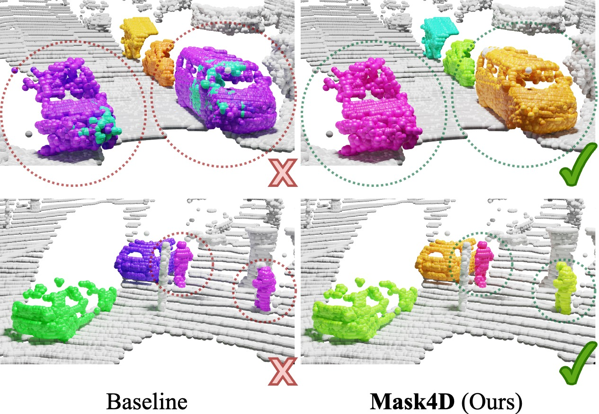

# Mask4D: Mask Transformer for 4D Panoptic Segmentation 
<div align="center">
<a href="https://github.com/YilmazKadir/">Kadir Yilmaz</a>, 
<a href="https://jonasschult.github.io/">Jonas Schult</a>,
<a href="https://nekrasov.dev/">Alexey Nekrasov</a>, 
<a href="https://www.vision.rwth-aachen.de/person/1/">Bastian Leibe</a>

RWTH Aachen University

Mask4D is a transformer-based model for 4D Panoptic Segmentation, achieving a new state-of-the-art performance on the SemanticKITTI test set.

<a href="https://pytorch.org/get-started/locally/"></a>
<a href="https://pytorchlightning.ai/"></a>
<a href="https://hydra.cc/"></a>
<a href="https://black.readthedocs.io/en/stable/"></a>



</div>
<br><br>

[[Project Webpage](https://vision.rwth-aachen.de/mask4d)] [[arXiv](https://arxiv.org/abs/2309.xxxxx)]

## News

* **2023-09-28**: Paper on arXiv

## Running the code
Soon!

## BibTeX
```
@articl{yilmaz2023mask4d,
  title     = {{Mask4D: Mask Transformer for 4D Panoptic Segmentation}},
  author    = {Yilmaz, Kadir and Schult, Jonas and Nekrasov, Alexey and Leibe, Bastian},
  journal   = {arXiv prepring arXiv:2309.xxxxx},
  year      = {2023}
}
```
